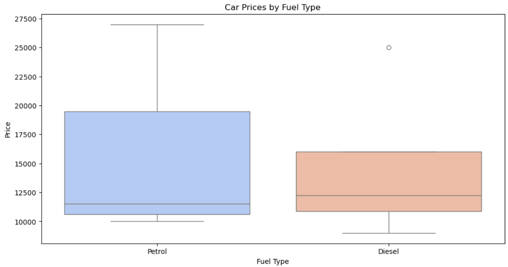
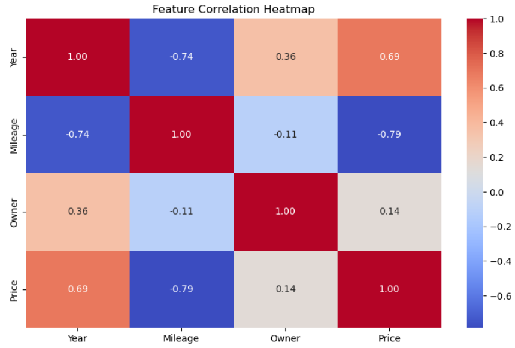
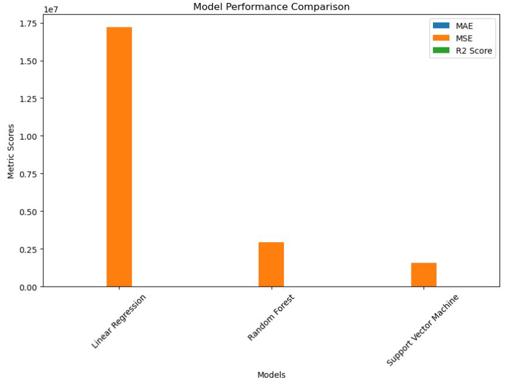

# 🚗 Car Price Prediction Using Machine Learning

## 📌 Project Overview
This project aims to predict car prices using various **machine learning techniques**. The dataset includes multiple attributes like **fuel type, mileage, and transmission type**, which influence a car's price. By applying machine learning models, we can estimate car prices based on historical data.

## 🎯 Why This Project?
Car price prediction is crucial for:
- 🏆 **Buyers** – Making informed purchasing decisions.
- 💰 **Sellers** – Setting competitive prices.
- 📊 **Businesses** – Understanding market trends and pricing dynamics.

---

## 📂 Dataset
The dataset consists of:
- 🔹 **Categorical Features**: Fuel type, transmission type, etc.
- 🔸 **Numerical Features**: Mileage, engine power, etc.
- 🎯 **Target Variable**: Car price

## 🛠 Key Steps in the Project

### 📌 1. Data Preprocessing
✔ **Handling Missing Values** – Rows with missing values are removed.  
✔ **Feature Selection** – The 'Model' column is dropped as it is too granular.  
✔ **Encoding Categorical Variables** – One-hot encoding is used for categorical features.  
✔ **Scaling Numerical Features** – StandardScaler is applied to normalize numerical values.  

### 📊 2. Exploratory Data Analysis (EDA)
#### **📦 Boxplot: Car Prices by Fuel Type**

🔹 This chart shows how different fuel types influence car prices. It allows us to:
   - Compare median car prices for different fuel types.
   - Identify outliers that might be luxury or economy cars.
   - Observe if fuel type significantly impacts pricing trends.

#### **📈 Scatter Plot: Price vs Mileage by Transmission Type**

🔸 This scatter plot helps us understand:
   - How mileage affects the price of cars.
   - Differences in pricing trends between manual and automatic transmissions.
   - If there is a general pattern where higher mileage results in lower prices.

#### **🔥 Feature Correlation Heatmap**

💡 The heatmap shows relationships between numerical features and price:
   - Darker colors indicate stronger positive or negative correlations.
   - Helps in feature selection by identifying variables that have the most impact on car price.
   - Avoids using redundant or weakly related features for better model performance.

---

## 🤖 3. Model Training and Evaluation
### 🔬 Machine Learning Models Used
- 📏 **Linear Regression** – Provides a basic understanding of linear relationships.
- 🌲 **Random Forest Regressor** – Captures non-linear relationships effectively.
- ⚡ **Support Vector Machine (SVR)** – Useful for complex, high-dimensional datasets.

### 📊 Model Evaluation Metrics
✔ **Mean Absolute Error (MAE)** – Measures the average absolute error between predicted and actual prices. Lower values indicate better accuracy.  
✔ **Mean Squared Error (MSE)** – Penalizes larger errors more heavily than MAE. A lower MSE indicates a better model fit.  
✔ **R² Score** – Represents how well the model explains variance in car prices. A value closer to 1 means better performance.

### 📉 Understanding the Model Performance Chart

📊 A **bar chart** compares the models based on MAE, MSE, and R² scores:
   - Lower MAE and MSE values indicate better predictions.
   - A higher R² score means the model explains price variations better.
   - Helps identify the best-performing model for this dataset.

---

## 🎯 Conclusion
This project showcases how **machine learning** can be applied to predict car prices with high accuracy. The models provide insights into key factors influencing car pricing and help optimize decision-making in the automobile industry.

## 🚀 Future Improvements
🔹 Experimenting with additional features like brand reputation.  
🔹 Hyperparameter tuning for model optimization.  
🔹 Deploying the model as a **web application** for real-time predictions.  

## 👨‍💻 Author
Meghana - [LinkedIn](https://www.linkedin.com/in/bgem/)

